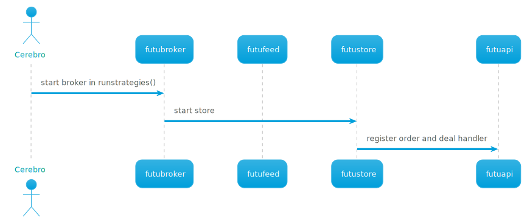
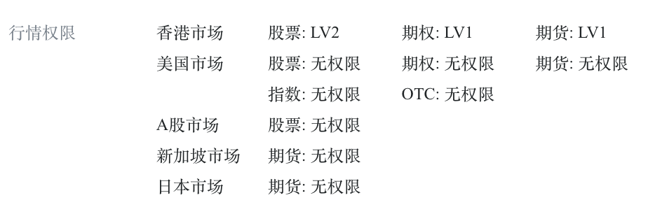

README
====



A store of [Backtrader](https://www.backtrader.com/) to integrate with [Futu broker's API](https://github.com/FutunnOpen/py-futu-api).

## How to Start

1. Install `FutuOpenD` following [Futu OpenAPI 介绍](https://openapi.futunn.com/futu-api-doc/), login and start the server. Note:
   1. the version of `FutuOpenD` should >= 6.2.2708.
   2. please check the market data access, for example, in `FutuOpenD` GUI, it will show the information as
   

2. Init the virtual env and install the dependencies
   ```
   python3 -m venv venv
   source venv/bin/activate
   pip install --upgrade pip
   pip install -r requirements.txt
   ```
 
## Others 

Note 

- [the access to US stock market is not free](https://github.com/FutunnOpen/py-futu-api/issues/53).

Reference

- [Live Trading](https://www.backtrader.com/docu/live/live/)
- [IB store](https://github.com/mementum/backtrader/blob/master/backtrader/stores/ibstore.py)
- [bt-ccxt-store](https://github.com/Dave-Vallance/bt-ccxt-store)